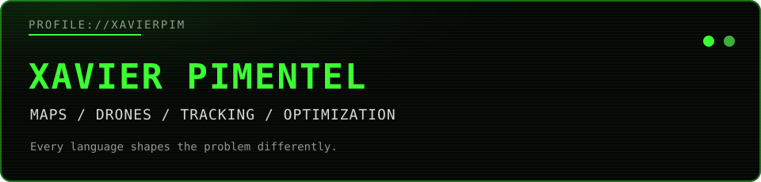
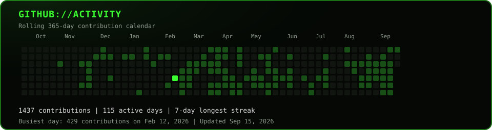

  

  <a href="https://me.perxent.net">Portfolio</a> |
  <a href="https://me.perxent.net/experience">Experience</a> |
  <a href="https://me.perxent.net/projects">Projects</a> |
  <a href="https://www.linkedin.com/in/xavier-p-0a5b48132/">LinkedIn</a> |
  <a href="mailto:royxavierp@gmail.com">Email</a>

## What I work on

### Geospatial Software

### Drone Systems

### Group Tracking

### Map Rendering

### Detection Pipelines

### Optimization

### Workflow Tooling

## [Projects](https://me.perxent.net/projects)

### MIA + Builder

- Mobile agent scaffold connecting project conversations, remote builds, artifacts, patches, and device testing.

### Takeout WMS

- Warehouse management system for SKU search, structured counts, locations, par levels, and supplier reorders.

### [Umbrella](https://umbrellabby15.web.app/)

- Group safety and proximity tracker with event invitations, optional location sharing, and organizer alerts.

### [requestSRC](https://github.com/XavierPim/requestSRC)

- Express middleware for capturing request metadata and reviewing traffic through a PostgreSQL-backed dashboard.

### [RemoteShell](https://github.com/XavierPim/RemoteShell_IPV4)

- C networking scaffold for IPv4 sockets, server lifecycles, signals, and concurrent connections.

### PHRAG Studio

- CRM and public web platform connecting contacts, projects, material records, inquiries, and studio content.

## GitHub activity

  

